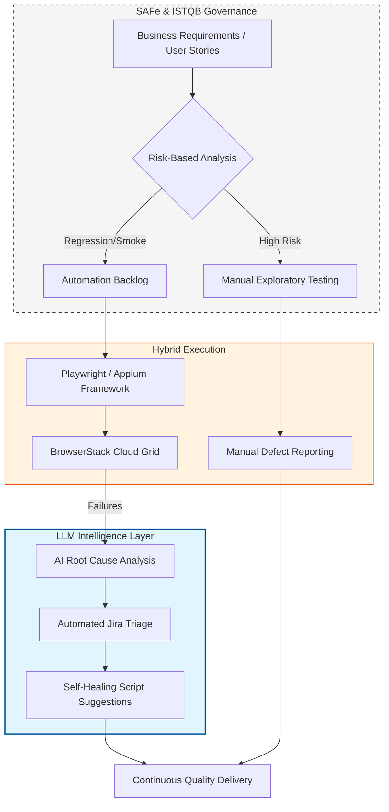

# 🚀 QA Transformation Roadmap
**Lead Consultant:** Baskar P. (ISTQB & SAFe Agile Certified)

> **A Strategic Vision for AI-Accelerated Quality Engineering**

---

## 🎯 The Vision: Hybrid Intelligence
Transition from reactive testing to a **Risk-Based, AI-Accelerated Ecosystem**, balancing Manual QA critical thinking with Automation speed under SAFe and ISTQB governance.

---

### 🗺️ The Strategic Workflow
Powered by an integrated architecture across governance, execution, and AI acceleration:

# 🗺️ Strategic QA Maturity Roadmap (TMMi-Based)
> **Goal:** Transitioning 'My Sky App' from Reactive Testing (Level 1) to Optimized Engineering (Level 5).

This roadmap defines the engineering standards required to maintain a high-velocity release cadence (Weekly/On-Demand) while ensuring zero regression in user experience.

---

## 📊 TMMi Maturity Matrix (Sky Engineering Standard)

| Pillar | Level 1 (Initial/Baseline) | Level 5 (Optimized Target) |
| :--- | :--- | :--- |
| **Shift Left** | QA is a downstream activity. | **PI Planning:** Test dependencies are mapped before PI planning starts. |
| **Test Triangle** | Limited device testing. | **Test Pyramid:** Test type ratios adhere to the test triangle |
| **Maintainability** | Legacy scripts accumulate. | **Pruning:** Test packs are reviewed, pruned, and refactored every sprint. |
| **Manual & Exp.** | Ad-hoc clicking. | **Chartered Exploratory:** Structured exp-testing of all features in the Program Interval. |
| **Accessibility** | No formal checks. | **Shift-Left A11y:** Browser extensions (Axe/Wave) used for pre-commit checks. |
| **Observability** | Vague "Assertion Failed" logs. | **Precision Logs:** We adhere to a process to act on insights provided by test dashborad metrics|
| **Failing Tests** | Re-run and ignore. | **RCA Governance:** Defined Root Cause Analysis process for every test failure. |
| **CI/CD Pipeline** | Local execution only. | **Build Server:** All automated tests integrated into build server (GitHub Actions/Jenkins). |
| **Run Times** | Over-night runs. | **The 10-Min Rule:** Pipeline suites complete in <10 mins 80% of the time. |

---

## 🛠️ Implementation Plan: The "3-Step Pivot"

### Step 1: Governance (Month 1-2)
- Implement the **Root Cause Analysis (RCA)** process to stop "flaky" tests from being ignored.
- Establish the **Shift-Left** protocol: QA Leads must sign off on dependencies during PI planning.

### Step 2: Technical Hardening (Month 3-4)
- Migrate all local scripts to **CI/CD Pipelines**.
- Enforce the **10-Minute Rule**: Parallelize suites using Playwright/Docker to ensure feedback is fast.
- Integrate **Accessibility (A11y)** extensions into the developer pre-commit workflow.

### Step 3: Optimization & Pruning (Ongoing)
- Quarterly **Pruning Workshops**: Delete tests that haven't failed in 6 months or are redundant.
- **Exploratory Charters**: Shift manual effort from "script following" to high-value exploratory testing of new Program Interval features.

---

## 📈 Success Metrics (KPIs)
- **TMMi Scorecard:** Quarterly audit to verify pillars have moved from L1 to L5.
- **Release Velocity:** Number of releases supported per month without increasing "Hardening" time.
- **Defect Leakage:** Maintaining <2% leakage despite faster run times.
