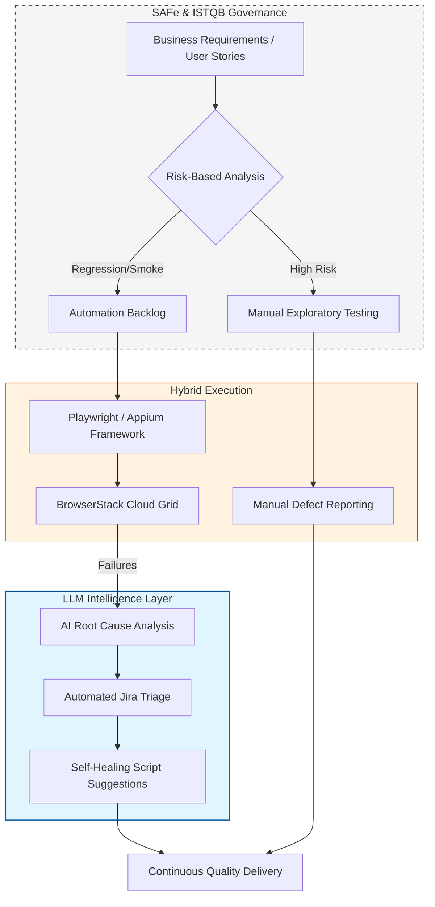

# 🚀 QA Transformation Roadmap

> **A Strategic Vision for AI-Accelerated Quality Engineering**

This document outlines a strategic roadmap to evolve a QA team from a traditional, reactive testing model to a modern, AI-accelerated Quality Engineering ecosystem. It is based on the TMMi model and aligned with SAFe and ISTQB standards.

---

## 🎯 The Vision: Hybrid Intelligence

The end goal is to create a **Risk-Based, AI-Accelerated Ecosystem** that balances the critical thinking of manual QA with the speed and scalability of automation. This approach ensures high-velocity releases without compromising quality.

---

## 🗺️ The Strategic Workflow

The roadmap is powered by an integrated architecture that connects governance, execution, and AI acceleration.

---

## 📈 TMMi Maturity Matrix (From Level 1 to Level 5)

This matrix defines the engineering standards required to progress from a reactive (Level 1) to an optimized (Level 5) state.

| Pillar | Level 1 (Initial/Baseline) | Level 5 (Optimized Target) |
| :--- | :--- | :--- |
| **Shift Left** | QA is a downstream, post-development activity. | **PI Planning Integration:** Test dependencies are identified and mapped *before* PI planning begins. |
| **Test Pyramid** | Testing is heavily reliant on slow, brittle UI tests. | **Balanced Pyramid:** Test ratios adhere to the ideal test pyramid (unit, integration, UI). |
| **Maintainability** | Legacy scripts accumulate technical debt. | **Continuous Pruning:** Test suites are reviewed, pruned, and refactored every sprint to remove redundancy. |
| **Manual Testing** | Ad-hoc, unscripted "bug hunts." | **Chartered Exploratory:** Manual testing is structured, with clear charters and goals for each session. |
| **Accessibility** | No formal accessibility checks are performed. | **Shift-Left A11y:** Developers use browser extensions (Axe/Wave) for pre-commit accessibility checks. |
| **Observability** | Vague "Assertion Failed" logs offer little insight. | **Actionable Insights:** Dashboards provide precise metrics, and a process exists to act on them. |
| **Test Failures** | Flaky tests are re-run or ignored. | **RCA Governance:** A defined Root Cause Analysis (RCA) process is mandatory for every test failure. |
| **CI/CD Pipeline** | Automation is run locally on demand. | **Fully Integrated CI/CD:** All automated tests are integrated into the build server (e.g., GitHub Actions, Jenkins). |
| **Run Times** | Test suites run overnight, delaying feedback. | **The 10-Minute Rule:** Critical pipeline suites complete in under 10 minutes, providing rapid feedback. |

---

## 🛠️ Implementation Plan: The "3-Step Pivot"

### Step 1: Governance & Foundation (Months 1-2)
*   **Implement RCA Process:** Establish a mandatory Root Cause Analysis process to eliminate "flaky" tests and ensure failures are addressed.
*   **Establish Shift-Left Protocol:** Require QA Lead sign-off on test dependencies during PI planning to ensure quality is built-in early.

### Step 2: Technical Hardening & Integration (Months 3-4)
*   **Migrate to CI/CD:** Move all local automation scripts to a centralized CI/CD pipeline.
*   **Enforce the 10-Minute Rule:** Parallelize test suites using modern tools (e.g., Playwright with sharding) to guarantee fast feedback.
*   **Integrate Accessibility (A11y):** Embed automated accessibility checks into the developer's pre-commit workflow.

### Step 3: Optimization & Continuous Improvement (Ongoing)
*   **Quarterly Pruning Workshops:** Regularly review and remove tests that are redundant or have not failed in over six months.
*   **Adopt Exploratory Charters:** Shift manual testing efforts from repetitive script execution to high-value, chartered exploratory testing.

---

## 📊 Success Metrics (KPIs)

*   **TMMi Scorecard:** Conduct quarterly audits to track progress from Level 1 to Level 5.
*   **Release Velocity:** Measure the number of releases supported per month without increasing "hardening" or stabilization time.
*   **Defect Leakage:** Maintain a defect leakage rate of less than 2% despite faster release cycles.
