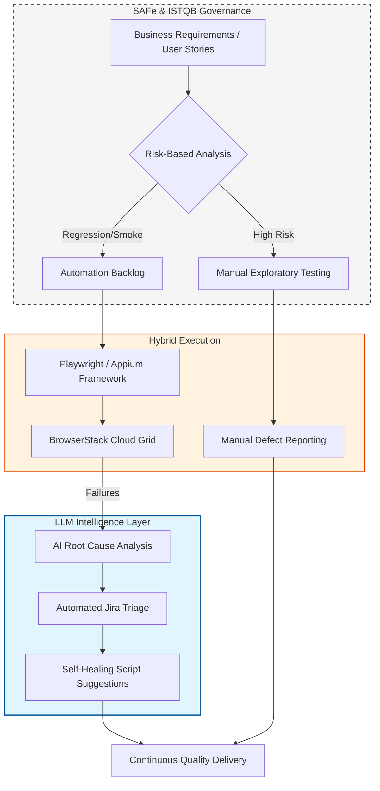

# 🚀 QA Transformation Roadmap: Full-Spectrum Quality Engineering
**Lead Consultant:** Baskar P. (ISTQB & SAFe Agile Certified)

## 🎯 The Vision: Hybrid Intelligence
To transition from reactive testing to a **Risk-Based, AI-Accelerated Ecosystem**. This roadmap balances the critical thinking of Manual QA with the speed of Automation, governed by SAFe and ISTQB principles.

---

### 🗺️ The Strategic Workflow
This roadmap is powered by the following integrated architecture:

## 📊 Test Maturity Matrix (TMMi Integration)

| TMMi Level | Manual & Strategic Focus | Automation & AI Focus |
| :--- | :--- | :--- |
| **L1: Initial** | Ad-hoc testing; no formal risk analysis. | No scripts; manual regression only. |
| **L2: Managed** | **ISTQB Risk-Based Testing** introduced. | Basic smoke test automation; tool selection. |
| **L3: Defined** | **SAFe Agile** alignment; PI Planning integration. | Full regression suite; **BrowserStack** cloud grid. |
| **L4: Measured** | Metrics-driven: Defect Leakage & Root Cause. | CI/CD Quality Gates; API Contract Testing. |
| **L5: Optimized** | Strategic Quality Transformation & Governance. | **LLM-Powered Triage & Self-Healing Scripts.** |

## 📅 Implementation Phases

#### Phase 1: Governance & Risk (Months 1-2)
* **Shift-Left Strategy:** Involve QA in SAFe refinement sessions to prevent bugs at the requirement level.
* **Strategic Manual QA:** Apply ISTQB techniques to identify high-risk business logic that requires exploratory testing.
* **Core Architecture:** Set up the fundamental Playwright/Appium framework and thread-safe drivers.

#### Phase 2: Hybrid Execution (Months 3-4)
* **Centralized Reporting:** Establish a "Single Source of Truth" dashboard for both manual and automated results.
* **Exploratory Charters:** Execute time-boxed manual exploratory sessions for all new feature sets.
* **Massive Parallelization:** Scale automation on BrowserStack to achieve feedback loops of under 15 minutes.

#### Phase 3: AI-Driven Optimization (Months 5-6)
* **Intelligent Triage:** Deploy LLM-driven log analysis (OpenAI/Gemini) to categorize failures automatically.
* **Maintenance Reduction:** Use Generative AI to assist in updating Page Objects and repairing flaky tests.
* **Predictive Quality:** Use historical defect data to prioritize manual testing efforts in high-risk modules.
