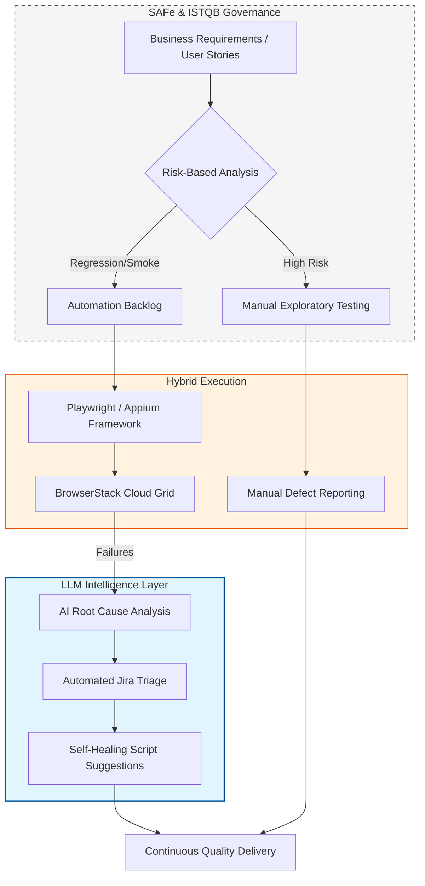

# 🚀 QA Transformation Roadmap
**Lead Consultant:** Baskar P. (ISTQB & SAFe Agile Certified)

> **A Strategic Vision for AI-Accelerated Quality Engineering**

---

## 🎯 The Vision: Hybrid Intelligence
Transition from reactive testing to a **Risk-Based, AI-Accelerated Ecosystem**, balancing Manual QA critical thinking with Automation speed under SAFe and ISTQB governance.

---

### 🗺️ The Strategic Workflow
Powered by an integrated architecture across governance, execution, and AI acceleration:

## 📊 Test Maturity Matrix (TMMi Integration)

| TMMi Level | Manual & Strategic Focus | Automation & AI Focus |
| :--- | :--- | :--- |
| **L1: Initial** | Ad-hoc testing; no formal risk analysis. | No scripts; manual regression only. |
| **L2: Managed** | **ISTQB Risk-Based Testing** introduced. | Basic smoke test automation; tool selection. |
| **L3: Defined** | **SAFe Agile** alignment; PI Planning integration. | Full regression suite; **BrowserStack** cloud grid. |
| **L4: Measured** | Metrics-driven: Defect Leakage & Root Cause. | CI/CD Quality Gates; API Contract Testing. |
| **L5: Optimized** | Strategic Quality Transformation & Governance. | **LLM-Powered Triage & Self-Healing Scripts.** |

## 📅 Implementation Phases

#### Phase 1: Governance & Risk (Months 1-2)
* **Shift-Left Strategy:** QA in SAFe refinement to prevent defects at requirements.
* **Strategic Manual QA:** ISTQB techniques to target high-risk logic with exploratory testing.
* **Core Architecture:** Stand up Playwright/Appium foundation and thread-safe drivers.

#### Phase 2: Hybrid Execution (Months 3-4)
* **Centralized Reporting:** Single Source of Truth for manual + automated results.
* **Exploratory Charters:** Time-boxed charters for all new feature sets.
* **Massive Parallelization:** BrowserStack scaling to keep feedback <15 minutes.

#### Phase 3: AI-Driven Optimization (Months 5-6)
* **Intelligent Triage:** LLM log analysis (OpenAI/Gemini) to auto-categorize failures.
* **Maintenance Reduction:** Generative AI assists in Page Object updates and flaky fixes.
* **Predictive Quality:** Historical defect data drives manual focus on high-risk modules.

---
