# Hi, I'm Baskar 👋
### QA Solutions Architect | Full-Stack Automation & GenAI Specialist

---

# Hi, I'm Baskar 👋

## 👨‍💻 About Me

As a **Lead QA Consultant**, I specialize in designing high-performance testing ecosystems that don't just find bugs, but accelerate the entire Software Development Life Cycle (SDLC).

With a deep focus on **Web, Mobile, and API layers**, I build frameworks that are:
* **Scalable:** Leveraging Cloud Grids like **BrowserStack** and **Docker** for massive parallelization.
* **Thread-Safe:** Engineered with advanced Java/TypeScript patterns to ensure 100% reliable execution.
* **AI-Enhanced:** I utilize **LLMs and Prompt Engineering** to automate boilerplate code generation, log analysis, and Jira triage, reducing framework maintenance by 40%.

## 🏛️ Quality Governance & Strategy
Beyond automation, I specialize in maturing QA organizations using Agile and industry-standard frameworks:
- **ISTQB Certified:** Expert in Test Design, Risk Analysis, and Defect Management.
- **SAFe Agile Practitioner:** Deep experience in Scaled Agile Frameworks, participating in PI Planning and cross-team dependency management.
- **Test Maturity Matrix (TMMi):** Engineered a strategic roadmap to transition QA teams from **Level 1 (Initial)** to **Level 5 (Optimized)**, focusing on process repeatability and preventative testing.

> 📖 **Strategic Asset:** [View my full QA Transformation Roadmap & Maturity Matrix](./QA_STRATEGY_ROADMAP.md)

---

### 🔄 AI Triage & Self-Heal Loop

```mermaid
sequenceDiagram
    participant J as Jira/Jenkins
    participant AI as 🤖 LLM (OpenAI/Gemini)
    participant F as 🧰 Automation Framework
    J->>AI: 📩 Send Jira Ticket Data
    AI->>AI: 🧠 Analyze Logic
    AI->>F: 🛠️ Generate/Fix Page Objects & Scripts
    F->>J: ✅ Update Ticket "automation complete"
```

Figure: Ticket triage to automated fix, closed-loop.

## 🏗️ Featured Automation Ecosystems

### 📱 [Mobile Automation (Appium + BDD)](https://github.com/bastheboss7/MobileAutomation_BDD_Framework)
* **Stack:** Java, Appium, Cucumber, TestNG.
* **Core:** 🤖 Enterprise-grade BDD mobile automation framework for iOS & Android using Appium, Cucumber, TestNG, and BrowserStack SDK. Thread-safe parallel execution with comprehensive reporting.
* **[🟢 View Live Test Report](https://automation.browserstack.com/reports/ac916e2b-627b-4bc5-9aa4-b2587f8cb97c?public_token=7ce047bcdca74327ea430913f82686226392d79c3f173c7d398d9cdb9bd30762)**

### 🎭 [Modern Web UI (Playwright + TS)](https://github.com/bastheboss7/Playwright_WebUI)
* **Stack:** Playwright, TypeScript, GitHub Actions.
* **Core:** Enterprise-grade Playwright & TypeScript framework for Evri Parcel Services. Features cross-browser CI/CD with GitHub Actions and detailed artifact reporting.

### 🤖 [BDD Java Enterprise Framework](https://github.com/bastheboss7/WebBrowserAutomation_BDD_Framework)
* **Tech:** Java, Selenium, Cucumber, TestNG.
* **Core:** UI Automated BDD Testing Framework, built with Java, Selenium, and Cucumber. Integrated with GitHub Actions & Docker containerised Jenkins for nightly CI/CD execution and live HTML reporting.
* **[🟢 View Live Test Report](https://bastheboss7.github.io/WebBrowserAutomation_BDD_Framework/)**

### ⚙️ [API & Backend (Rest-Assured)](https://github.com/bastheboss7/evri-api-automation-framework)
* **Stack:** Java, Rest-Assured, Jackson.
* **Core:** A robust, enterprise-grade REST API test automation framework built with Java 21, REST Assured, Cucumber BDD, and TestNG. Designed for scalability, maintainability, and comprehensive reporting for Evri's parcel delivery operations.

### 🤖 [AI-Driven Quality Suite](https://github.com/bastheboss7/GenAI-Jira-Integration)
* **Stack:** Node, OpenAI, Jira API.
* **Core:** A full-stack app to convert user stories into structured test cases using LLMs, with React frontend and Node.js/Express backend.

**Impact highlights**
- ⏱️ 60% faster Jira triage via LLM-assisted root-cause summaries
- 🔁 45% reduction in flaky failures using self-healing locators & prompts
- 📈 35% uplift in regression throughput with parallelized grid runs
- 🛡️ 30% fewer escaped defects after shift-left contract checks

## 📺 Video Demo

Watch a demo of the app in action:

[▶️ Click here to view the video demo](https://drive.google.com/file/d/1QKkJHwcKfqYSE9t3ndEKwghyfAPDPccf/view?usp=drive_link)

---

- **Architecture:** Factory Pattern, Singleton, ThreadLocal Concurrency.
- **Methodologies:** BDD (Gherkin), Shift-Left Testing, CI/CD Pipeline Success.

## 🤖 AI-Accelerated Engineering
I leverage Generative AI and LLMs to compress the SDLC and build more resilient frameworks:
- **Prompt Engineering:** Developed custom system prompts to generate Page Objects and boilerplate code, reducing manual coding time by 60%.
- **Synthetics & Mocking:** Used LLMs to generate realistic, diverse test data (JSON/XML) for API contract testing.
- **Architectural Partnering:** Utilized AI as a thought partner for designing thread-safe `DriverManager` patterns and complex regex for log parsing.

---

## 📫 Connect with me
- **LinkedIn:** [https://www.linkedin.com/in/baskar-padmanaban-0587001a6/]
- **Email:** [bskr_5chennai@yahoo.co.in]
